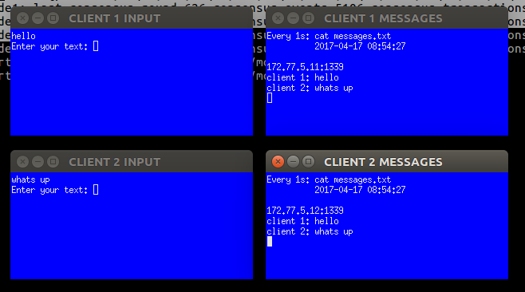

# BABBLE
## BFT Consensus platform for distributed applications.

[](https://circleci.com/gh/mosaicnetworks/babble)

Babble allows many computers to behave as one. It uses Peer to Peer (P2P) 
networking and a consensus algorithm to guarantee that multiple connected 
computers process the same commands in the same order; a technique known as 
state machine replication. This makes for secure systems that can tolerate 
arbitrary failures including malicious behaviour.

For guidance on how to install and use Babble please visit our 
[documentation](http://docs.babble.io) pages.

**NOTE**:
This is alpha software. Please contact us if you intend to run it in production.

## Consensus Algorithm and Blockchain

We use the Hashgraph consensus algorithm, invented by Leemon Baird.
It is best described in the 
[white-paper](http://www.swirlds.com/downloads/SWIRLDS-TR-2016-01.pdf) and its 
[accompanying document](http://www.swirlds.com/downloads/SWIRLDS-TR-2016-02.pdf).
The algorithm is protected by [patents](http://www.swirlds.com/ip/) in the USA. 
Therefore, anyone intending to use this software in the USA should obtain a 
license from the patent holders.

Hashgraph is based on the intuitive idea that gossiping about gossip itself 
yields enough information to compute a consensus ordering of events. It attains 
the theoretical limit of tolerating up to one-third of faulty nodes without 
compromising on speed. For those familiar with the jargon, it is a leaderless, 
asynchronous BFT consensus algorithm.

Babble projects the output of the consensus algorithm onto a linear blockchain 
which is more suitable for representing an ordered list of transactions and 
facilitates the creation of light-clients. For information about this projection
please refer to [documentation](http://docs.babble.io/blockchain.html) pages.

## Design

Babble is designed to integrate with applications written in any programming 
language.


```
    +--------------------------------------+
    | APP                                  |
    |                                      |
    |  +-------------+     +------------+  | 
    |  | Service     | <-- | State      |  |
    |  |             |     |            |  |
    |  +-------------+     +------------+  |
    |          |                |          |
    |       +----------------------+       |
    |       | Babble Proxy         |       |
    |       +----------------------+       |
    |          |                ^          |
    +----------|----------------|----------+
               |                |
--------- SubmitTx(tx) ---- CommitBlock(Block) ------- (JSON-RPC/TCP)
               |                |
 +-------------|----------------|------------------------------+
 | BABBLE      |                |                              |
 |             v                |                              |
 |          +----------------------+                           |
 |          | App Proxy            |                           |
 |          |                      |                           |
 |          +----------------------+                           |
 |                     |                                       |
 |   +-------------------------------------+                   |
 |   | Core                                |                   |
 |   |                                     |                   |
 |   |                                     |    +----------+   |
 |   |  +-----------+        +---------+   |    | Service  |   |
 |   |  | Hashgraph |        | Store   |   | -- |          | <----> HTTP API
 |   |  +-----------+        +----------   |    |          |   |
 |   |                                     |    +----------+   |
 |   |                                     |                   |
 |   +-------------------------------------+                   |
 |                     |                                       |
 |   +-------------------------------------+                   |
 |   | Transport                           |                   |
 |   |                                     |                   |
 |   +-------------------------------------+                   |
 |                     ^                                       |
 +---------------------|---------------------------------------+
                       |
                       v

                    Network
```
Almost any software application can be modelled in terms of a *service* and a 
*state*. The *service* is responsible for processing commands (ex. user input), 
while the *state* is responsible for manipulating and storing the data (eg. 
database). Usually, when commands require updating the data, the *service* will 
invoke the *state* directly. In a distributed application, however, commands 
(referred to as *transactions* in this context), must be broadcasted to all 
replicas and put in a common order before being applied to the *state*. This is 
what ensures that all replicas process the same commands in the same order. 
Hence, the *service* no longer communicates directly with the *state* (except 
for read-only requests), but forwards commands to a *transaction ordering 
system* which takes care of broadcasting and ordering the transactions across 
all replicas before feeding them back to the application's *state*. 

Babble is an ordering system that plugs into any application thanks to a very 
simple JSON-RPC interface over TCP. It uses a consensus algorithm, to replicate 
and order the transactions, and a blockchain to represent the resulting list. 
A blockchain is a linear data structure composed of batches of transactions, 
hashed and signed together, easily allowing to verify any transaction. So, 
instead of applying commands directly to the *state*, Babble applications must 
forward the commands to Babble and let them be processed asynchronously by the 
consensus system before receiving them back, in blocks, ready to be applied 
to the *state*.  

## Build from source

The easiest way to build binaries is to do so in a hermetic Docker container. 
Use this simple command:

```bash
[...]/babble$ make dist
```
This will launch the build in a Docker container and write all the artifacts in
the build/ folder.

```bash
[...]/babble$ tree build
build/
├── dist
│   ├── babble_0.1.0_darwin_386.zip
│   ├── babble_0.1.0_darwin_amd64.zip
│   ├── babble_0.1.0_freebsd_386.zip
│   ├── babble_0.1.0_freebsd_arm.zip
│   ├── babble_0.1.0_linux_386.zip
│   ├── babble_0.1.0_linux_amd64.zip
│   ├── babble_0.1.0_linux_arm.zip
│   ├── babble_0.1.0_SHA256SUMS
│   ├── babble_0.1.0_windows_386.zip
│   └── babble_0.1.0_windows_amd64.zip
└── pkg
    ├── darwin_386
    │   └── babble
    ├── darwin_amd64
    │   └── babble
    ├── freebsd_386
    │   └── babble
    ├── freebsd_arm
    │   └── babble
    ├── linux_386
    │   └── babble
    ├── linux_amd64
    │   └── babble
    ├── linux_arm
    │   └── babble
    ├── windows_386
    │   └── babble.exe
    └── windows_amd64
        └── babble.exe
```

## Dev

### Go
Babble is written in [Golang](https://golang.org/). Hence, the first step is to 
install **Go version 1.9 or above** which is both the programming language  and a 
CLI tool for managing Go code. Go is very opinionated and will require you to 
[define a workspace](https://golang.org/doc/code.html#Workspaces) where all your 
go code will reside.

### Babble and dependencies
Clone the [repository](https://github.com/mosaicnetworks/babble) in the appropriate 
GOPATH subdirectory:

```bash
$ mkdir -p $GOPATH/src/github.com/mosaicnetworks/
$ cd $GOPATH/src/github.com/mosaicnetworks
[...]/mosaicnetworks$ git clone https://github.com/mosaicnetworks/babble.git
```
Babble uses [Glide](http://github.com/Masterminds/glide) to manage dependencies.

```bash
[...]/babble$ curl https://glide.sh/get | sh
[...]/babble$ glide install
```
This will download all dependencies and put them in the **vendor** folder.

### macOS requirements

Bash scripts used in this project assume the use of gnu versions of coreutils.

Please ensure you have gnu versions of these programs installed:-

```
# --with-default-names makes the `sed` and `awk` commands default to gnu sed and gnu awk respectively.
brew install gnu-sed gawk --with-default-names
```

### Testing

Babble has extensive unit-testing. Use the Go tool to run tests:
```bash
[...]/babble$ make test
```

If everything goes well, it should output something along these lines:
```
ok      github.com/mosaicnetworks/babble/net      0.052s
ok      github.com/mosaicnetworks/babble/common   0.011s
?       github.com/mosaicnetworks/babble/cmd      [no test files]
?       github.com/mosaicnetworks/babble/cmd/dummy_client [no test files]
ok      github.com/mosaicnetworks/babble/hashgraph        0.174s
ok      github.com/mosaicnetworks/babble/node     1.699s
ok      github.com/mosaicnetworks/babble/proxy    0.018s
ok      github.com/mosaicnetworks/babble/crypto   0.028s
```

## Demo

To see Babble in action, we have provided a series of scripts to bootstrap a 
test network locally.

**NOTE:**
This has been tested on Ubuntu 16.04 and macOS.

Make sure you have [Docker](https://docker.com) installed.

Then, run the testnet:

```bash
[...]/babble$ cd demo
[...]/babble/demo$ make
```

Once the testnet is started, a script is automatically launched to monitor 
consensus figures:

```
consensus_events:180 consensus_transactions:40 events_per_second:0.00 id:1 last_block_index:3 last_consensus_round:17 num_peers:3 round_events:7 rounds_per_second:0.00 state:Babbling sync_rate:1.00 transaction_pool:0 undetermined_events:18
consensus_events:180 consensus_transactions:40 events_per_second:0.00 id:3 last_block_index:3 last_consensus_round:17 num_peers:3 round_events:7 rounds_per_second:0.00 state:Babbling sync_rate:1.00 transaction_pool:0 undetermined_events:20
consensus_events:180 consensus_transactions:40 events_per_second:0.00 id:2 last_block_index:3 last_consensus_round:17 num_peers:3 round_events:7 rounds_per_second:0.00 state:Babbling sync_rate:1.00 transaction_pool:0 undetermined_events:21
consensus_events:180 consensus_transactions:40 events_per_second:0.00 id:0 last_block_index:3 last_consensus_round:17 num_peers:3 round_events:7 rounds_per_second:0.00 state:Babbling sync_rate:1.00 transaction_pool:0 undetermined_events:20


```

Running ```docker ps -a``` will show you that 9 docker containers have been launched:
```
[...]/babble/demo$ docker ps -a
CONTAINER ID        IMAGE                    COMMAND                  CREATED             STATUS              PORTS                   NAMES
ba80ef275f22        mosaicnetworks/watcher   "/watch.sh"              48 seconds ago      Up 7 seconds                                watcher
4620ed62a67d        mosaicnetworks/dummy     "dummy '--name=client"   49 seconds ago      Up 48 seconds       1339/tcp                client4
847ea77bd7fc        mosaicnetworks/babble    "babble run --cache_s"   50 seconds ago      Up 49 seconds       80/tcp, 1337-1338/tcp   node4
11df03bf9690        mosaicnetworks/dummy     "dummy '--name=client"   51 seconds ago      Up 50 seconds       1339/tcp                client3
00af002747ca        mosaicnetworks/babble    "babble run --cache_s"   52 seconds ago      Up 50 seconds       80/tcp, 1337-1338/tcp   node3
b2011d3d65bb        mosaicnetworks/dummy     "dummy '--name=client"   53 seconds ago      Up 51 seconds       1339/tcp                client2
e953b50bc1db        mosaicnetworks/babble    "babble run --cache_s"   53 seconds ago      Up 52 seconds       80/tcp, 1337-1338/tcp   node2
0c9dd65de193        mosaicnetworks/dummy     "dummy '--name=client"   54 seconds ago      Up 53 seconds       1339/tcp                client1
d1f4e5008d4d        mosaicnetworks/babble    "babble run --cache_s"   55 seconds ago      Up 54 seconds       80/tcp, 1337-1338/tcp   node1
```
Indeed, each node is comprised of an App and a Babble node (cf Architecture section).

Run the **demo** script to play with the **Dummy App** which is a simple chat 
application powered by the Babble consensus platform:

```
[...]/babble/demo$ make demo
```



Finally, stop the testnet:
```
[...]/babble/demo$ make stop
```

