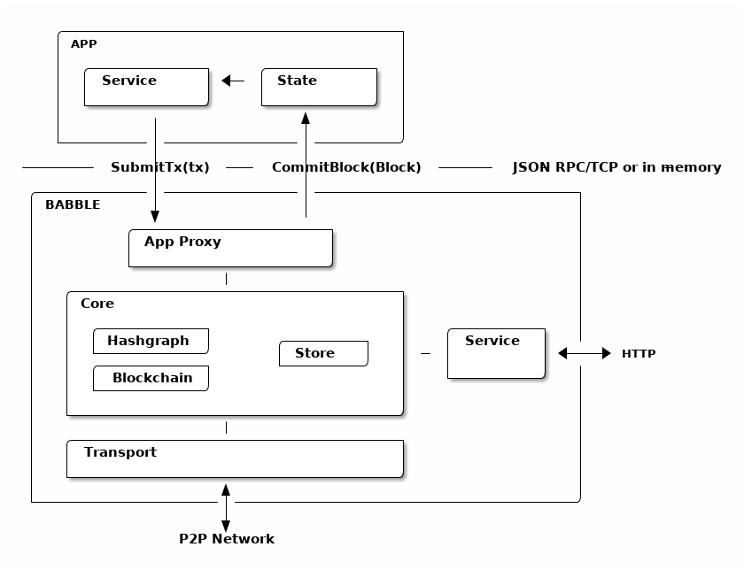

.. _design:

Design
======

Overview
--------

Almost any software application can be modeled in terms of a *service* and a
*state*. The *service* is responsible for processing commands (ex. user input),
while the *state* is responsible for manipulating and storing the data (eg.
database). Usually, when commands require updating the data, the *service* will
invoke the *state* directly. In a distributed application, however, commands
(referred to as *transactions* in this context), must be broadcast to all
replicas and put in a common order before being applied to the *state*. This
ensures that all replicas process the same commands in the same order. Hence,
the *service* no longer communicates directly with the *state* (except for
read-only requests), but forwards commands to a *transaction ordering system*
which takes care of broadcasting and ordering the transactions across all
replicas before feeding them back to the application's *state*.

Babble is an ordering system that plugs into any application thanks to a very
simple interface. It uses a consensus algorithm to replicate and order the
transactions, and a blockchain to represent the resulting list. A blockchain is
a linear data structure composed of batches of transactions, hashed and signed
together, allowing to easily verify any transaction. So, instead of applying
commands directly to the *state*, Babble applications must forward the commands
to Babble and let them be processed asynchronously by the consensus system
before receiving them back, in blocks, ready to be applied to the *state*.

Note that it is left to the application layer to filter out bad transactions 
before relaying them from clients to the consensus engine. Unlike other 
middleware designed to sit in front of the application (like Apache or 
Tendermint), the user-facing API is app-specific, and Babble just takes care or
managing the consensus "under the hood". This filtering partially addresses spam
from anonymous clients, but doesn't protect against malicious nodes spamming the
network; that is a potential enhancement on the roadmap.

Consensus and Blockchain
------------------------

At the core of Babble is an algorithm ensuring that all participants process
the same transactions in the same order. We have chosen to implement a system
suitable for the most adversarial conditions - with powerful attackers. This is
known as Byzantine Fault Tolerance (BFT) and has been a field of research for
over 30 years. Our system is based on our interpretation of a paper published
by Leemon Baird in 2016
`<http://www.swirlds.com/downloads/SWIRLDS-TR-2016-01.pdf>`__ which describes a
method for extracting a consensus order of events from a data structure
representing the history of gossip between a set of participants. Instead of
only gossiping transactions and exchanging votes directly, members gossip about
gossip itself; something that can be represented in a Directed Acyclic Graph
(DAG) - the hashgraph. The algorithm for extracting a consensus order from the
hashgraph is proven to work and attains the theoretical limits of Byzantine
fault-tolerance in terms of the number and power of the malicious members it
can cope with. The messaging routines required to gossip and create the
hashgraph are very simple compared to other BFT algorithms. The hashgraph
itself, however, is not ideal for representing the ordered list of transactions
because it is a two-dimensional object which doesn't explicitly express a
linear order of the items it contains. Hence, we developed a method to map the
hashgraph onto a blockchain.

A blockchain is a data structure where transactions are packaged in hash-linked
blocks. Each block is identified by a cryptographic hash and contains a hash of
the previous block, so that blocks can form a chain from the first block ever
to the last formed block. In this way, all the block - and transactions - are
connected via a linear linked list structure. In our system, blocks contain a
collection of signatures of their own hash from the participants. A block with
valid signatures from at least one third of validators can be considered valid
because - by hypothesis - at least one of those signatures is from an honest
member.

Projecting the hashgraph onto a blockchain makes it much easier for third
parties to verify the consensus order. It makes it possible to build
light-clients and to integrate Hashgraph based systems with other blockchains.
For more detail about the projection method, please refer to :ref:`blockchain`

