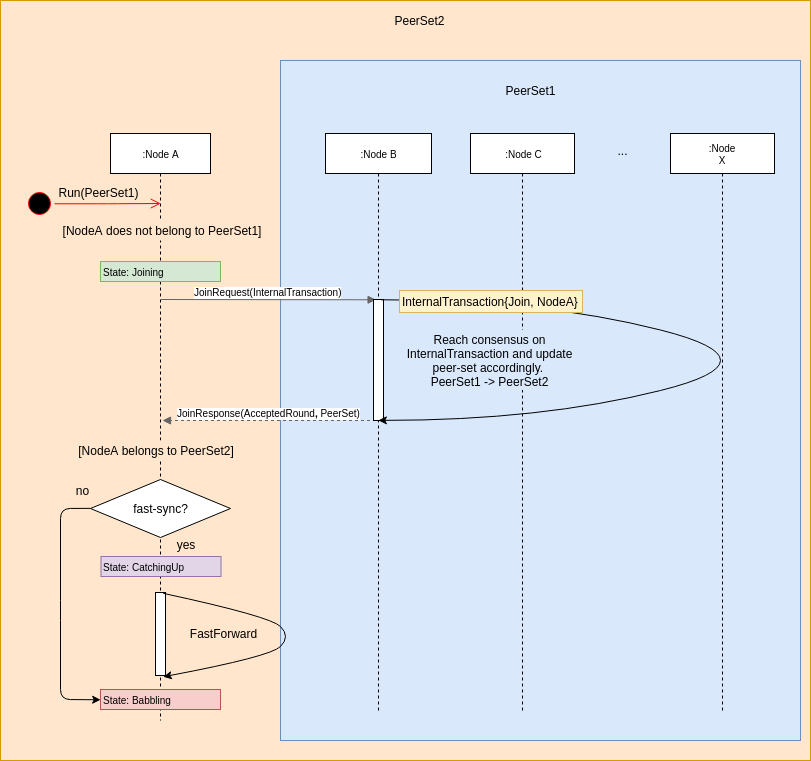

.. _dynamic_participants:

DynamicParticipants
===================

DynamicParticipants is an extension to the Babble protocol, which enables 
changing the set of active peers via consensus. Until now, we had only 
considered fixed peer-sets, where the list of participants was predetermined and 
unchanged throughout the life of a Babble network. This was an important 
limitation, hindering the formation of ad-hoc blockchains as we envision them. 
Here we present our solution, and its implementation, which relies on previous 
work regarding the Hashgraph-to-Blockchain projection, and FastSync.

Overview
--------

A Babble node is started with an initial peer-set and its own key pair. If its 
public key belongs to the initial peer-set, the node enters the Babbling state 
and starts gossipping regularly with other nodes. If it doesn’t belong to the 
initial peer-set, it enters the Joining state, in which it will attempt to join 
the group. It does so by automatically sending a JoinRequest to one of the 
existing peers, chosen at random from the initial peer-set. Upon receiving a 
JoinRequest, a node will create a corresponding InternalTransaction; a special 
type of transaction which represents potential peer-set changes. The 
InternalTransaction is added to an Event, and goes through Babble consensus, 
until it is added to a block and committed. However, unlike regular 
transactions, the InternalTransaction is actually interpreted by Babble to 
modify the peer-set, if the application-layer accepts it. We shall see that, 
according to Hashgraph dynamics, an accepted InternalTransaction, committed with 
round-received R, only affects peer-sets for rounds R+6 and above. If the 
JoinRequest was successful, the new node will then go into the CatchingUp state 
and fast-forward to the top of the Hashgraph, as described in [FastSync], to 
join the gossip in the extended group. The functionality for removing peers has 
not been implemented yet, but should closely resemble the Join procedure, with 
the difference that there will be an automatic way of deciding when nodes should 
be removed, based on a minimum level of activity (ex: 10 rounds with no 
witnesses).

InternalTransaction
-------------------

In contrast with regular transactions, which only affect the application layer, 
InternalTransactions are internal to Babble. Babble acts upon 
InternalTransactions to modify part of its own state, the peer-set, rather than 
modifying the application’s state. However, the application layer gets to accept 
or refuse peer-set changes during the block commit phase. For example, the 
application could refuse all InternalTransactions (thereby preventing the 
peer-set from ever changing), or accept only up to N participants, or finally, 
it could base the decision on a predefined whitelist; anything goes, as long as 
the rule is deterministic (all nodes make the same decision).

::

  type InternalTransaction struct {
    Type     TransactionType // PEER_ADD or PEER_REMOVE
    Peer     peers.Peer // { IP:PORT, PubKey }
    Accepted Trilean // True, False, or Undecided
  }

The ProxyInterface, between Babble and the application-layer, is thus slightly 
extended to account for InternalTransactions. Here is a example of a 
CommitHandler that systematically accepts all InternalTransactions:

::

  func (a *State) CommitHandler(block hashgraph.Block) (proxy.CommitResponse, error) {
    a.logger.WithField("block", block).Debug("CommitBlock")
    
    err := a.commit(block)
    if err != nil {
        return proxy.CommitResponse{}, err
    }
    
    for _, it := range block.InternalTransactions() {
        it.Accept()
    }
    
    response := proxy.CommitResponse{
        StateHash:            a.stateHash,
        InternalTransactions: block.InternalTransactions(),
     }
    
    return response, nil
  }

PeerSet
-------

Until now, the peer-set has been a static list of peers; we now associate each 
Hashgraph round with a potentially different peer-set. We maintain a sorted 
table of round-to-peer-set associations, such that all rounds between two 
consequent entries of this table are associated with the left-most peer-set. 
For example, if the table of peer-sets is [{0, PS1}, {5, PS2}, {12, PS3}], then 
rounds 0 to 4 will be associated to peer-set PS1, rounds 5 to 11 will be 
associated to PS2, and rounds 12 and above will be associated to PS3 (until the 
peer-set changes again).

We will see in the next section how to account for different peer-sets in the 
core consensus methods, but since they are allowed to change from one round to 
another, peer-sets must also be accounted for in the Frame and Block 
data-structures. Indeed, when verifying a Block, one must know which peer-set to 
count signatures against. Therefore, we have extended the Frame and Block 
objects to contain a PeerSetHash, that uniquely identifies the peer-set of the 
corresponding round-received. In the future, we will need to include a proof of 
peer-set change inside the Blocks, so that clients may follow and verify the 
evolution of the peer-set; ie, something that captures the following 
information:

::

  PS0 + InternalTransaction0 + PS0-signatures(InternalTransaction0) => PS1
  PS1 + InternalTransaction1 + PS1-signatures(InternalTransaction1) => PS2
  …
  PSN + InternalTransactionN + PSN-signatures(InternalTransactionN) => PSN+1

Algorithm Updates
-----------------

There is no better documentation than the code itself, but here is a high level 
overview of what has changed. This section assumes familiarity with Babble, and 
Hashgraph.

StronglySee
***********

Informally, StronglySee is the function that determines whether there is a path 
in the Hashgraph connecting two Events such that the path includes Events from a 
strong majority of participants. This obviously begs the question: “strong 
majority of which set of participants?”. So we extended the StronglySee method 
with a PeerSet parameter.

Round
*****

An Event’s round is determined by taking the max of its parents rounds, and 
adding 1 if, and only if, the Event can strongly-see a super-majority of 
Witnesses from that round (max of the parents). So, in this call to StronglySee, 
we pass the peer-set corresponding to the max parent round, and the 
super-majority is counted based on the max parent round peer-set.

Witness
*******

An Event is a witness if, and only if, it is a creator's first Event in its 
round AND its creator belongs to the round’s peer-set.

Fame
****

With DynamicParticipants, different peer-sets may be involved in deciding the 
fame of a single witness. Although, Babble’s implementation of the Hashgraph 
algorithm is slightly different, here are the changes that DynamicParticipants 
introduce in the algorithm as described in the original Hashgraph whitepaper: 

::

  for each event x in order from earlier rounds to later 
    x . famous ← UNDECIDED 
    for each event y in order from earlier rounds to later 
        if x . witness and y . witness and y . round>x . round 
            d ← y . round - x . round 
            s ← the set of witness events in round y . round -1 that y can strongly see 
    **     [based on y.round-1 peer-set]	
            v ← majority vote in s ( is TRUE for a tie ) 
            t ← number of events in s with a vote of v 
            
            if d = 1 // first round of the election 
                y . vote ← can y see x ? 
            else 
    **          [n ←  number of peers in y.round peer-set]
                if d mod c > 0 // this is a normal round 
                    if t > 2* n /3 // if supermajority, then decide
                        x . famous ← v 
                        y . vote ← v 
                        break out of the y loop 
                    else // else, just vote 
                        y . vote ← v 
                else // this is a coin round 
                    if t > 2* n /3 // if supermajority, then vote 
                        y . vote ← v 
                    else // else flip a coin 
                        y . vote ← middle bit of y . signature 

R+6
***

When an InternalTransaction is committed, when should we start counting the new 
peer-set in order to guarantee that all correct nodes will do the same thing? 
The answer is R+6 where R is the round-received of the Event containing the 
InternalTransaction.

We need only determine the lower-bound because the goal is obviously to change 
the peer-set as soon as possible.

The solution is basically contained in Lemmas 5.15 and 5.17 of the 
`original hashgraph whitepaper <https://www.swirlds.com/downloads/SWIRLDS-TR-2016-01.pdf>`__:

    Lemma 5.15.
    If hashgraphs A and B are consistent, and A decides a Byzantine agreement 
    election with result v in round r and B has not decided prior to r, then
    B will decide v in round r + 2 or before.

    Lemma 5.17. 
    For any round number r, for any hashgraph that has at least one event in 
    round r+3, there will be at least one witness in round r that will be 
    decided to be famous by the consensus algorithm, and this decision will be 
    made by every witness in round r + 3, or earlier.

If one hashgraph decides RoundReceived = R, then a strong majority of round R 
witnesses are decided, and by Lemma 5.17 they are necessarily decided in round 
R+3 or earlier. Hence, by Lemma 5.15, any other consistent hashgraph will have 
decided by round R + 5 or earlier. It is then safe to set the new peer-set for
round R + 6.

