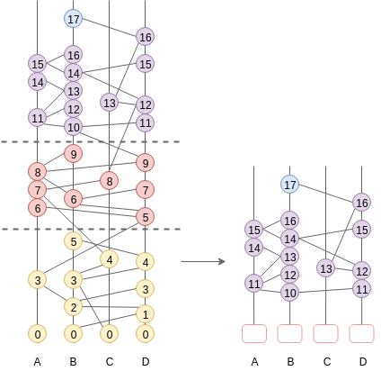
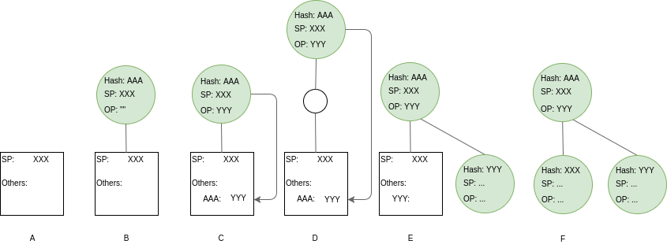

.. _fastsync:

FastSync
========

FastSync is an element of the Babble protocol which enables nodes to catch up 
with other nodes without downloading and processing the entire history of gossip 
(Hashgraph + Blockchain). It is important in the context of mobile ad hoc 
networks where users dynamically create or join groups, and where limited 
computing resources call for periodic pruning of the underlying data store. The 
solution relies on linking snapshots of the application state to independent and 
self-contained sections of the Hashgraph, called Frames. A node that fell back 
too far may fast-forward straight to the latest snapshot, initialize a new
Hashgraph from the corresponding Frame, and get up to speed with the other nodes 
without downloading and processing all the transactions it missed. Of course, 
the protocol maintains the BFT properties of the base algorithm by packaging 
relevant data in signed blocks; here again we see the benefits of using a 
blockchain mapping on top of Hashgraph. Although implementing the 
Snapshot/Restore functionality puts extra strain on the application developer, 
it remains entirely optional; FastSync can be activated or deactivated via 
configuration.    

Overview
--------

.. image:: assets/fastsync.png

The Babble node is implemented as a state machine where the possible states are: 
**Babbling**, **CatchingUp**, and **Shutdown**. A node is normally in the 
**Babbling** state where it performs the regular Hashgraph gossip routines, but 
a **sync_limit** response from a peer will trigger the node to enter the 
**CatchingUp** state, where it will attempt to fast-forward to a recent 
snapshot. A **sync_limit** response indicates that the number of Events that the
node needs to download exceeds the **sync_limit** configuration value. 

In the **CatchingUp** state, a node repeatedly chooses another node at random 
(although the above diagram uses the same peer that returned the **sync_limit** 
response) and attempts to fast-forward to their last consensus snapshot, until 
the operation succeeds. Hence, FastSync introduces a new type of command in the 
communication protocol: *FastForward*.

Upon receiving a FastForwardRequest, a node must respond with the last consensus 
snapshot, as well as the corresponding Hashgraph section (the Frame) and Block. 
With this information, and having verified the Block signatures against the 
other items as well as the known validator set, the requesting node attempts to 
reset its Hashgraph from the Frame, and restore the application from the 
snapshot. The difficulty resides in defining what is meant by *last consensus* 
snapshot, and how to package enough information in the Frames as to form a base 
for a new/pruned Hashgraph. 

Frames
------

Frames are self-contained sections of the Hashgraph. They are composed of Roots 
and regular Hashgraph Events, where Roots are the base on top of which Events 
can be inserted. Basically, Frames form a valid foundation for a new Hashgraph,
such that gossip-about-gossip routines are not discontinued, while earlier 
records of the gossip history are ignored. 

::

  type Frame struct {
  	Round  int     //RoundReceived
  	Roots  []Root  //[participant ID] => Root
  	Events []Event //Events with RoundReceived = Round
  }

A Frame corresponds to a Hashgraph consensus round. Indeed, the consensus 
algorithm commits Events in batches, which we map onto Frames, and finally onto 
a Blockchain. This is an evolution of the previously defined :ref:`blockchain 
mapping <blockchain>`. Block headers now contain a Frame hash. As we will see 
later, this is useful for security. The Events in a Frame are the Events of the 
corresponding batch, in consensus order.

.. image:: assets/dag_frames_bx.png

Roots
-----

Frames also contain Roots. To get an understanding for why this is necessary, we
must consider the initial state of a Hashgraph, i.e., the base on top of which 
the first Events are inserted. 

The Hashgraph is an interlinked chain of Events, where each Event contains two 
references to anterior Events (SelfParent and OtherParent). Upon inserting an 
Event in the Hashgraph, we check that its references point to existing Events 
(Events that are already in the Hashgraph) and that at least the SelfParent 
reference is not empty. This is partially illustrated in the following picture 
where Event A2 cannot be inserted because its references are unknown. 

.. image:: assets/roots_0.png

So what about the first Event? Until now, we simply implemented a special case, 
whereby the first Event for any participant, could be inserted without checking 
its references. In fact the above picture shows that Events A0, B0, and C0, have
empty references, and yet they are part of the Hashgraph. This special case is 
fine as long as we do not expect to initialize Hashgraphs from a 'non-zero' 
state.

We introduced the concept of Roots to remove the special case and handle more
general situations. They make it possible to initialize a Hashgraph from a 
section of an existing Hashgraph, and discard everything below it.

A Root is a data structure containing condensed information about the ancestors 
of the first Events to be added to the Hashgraph. Each participant has a Root,
containing a *SelfParent* - the direct ancestor of the first Event for the 
corresponding participant - and *Others* - a map of Event hashes to the 
corresponding Other-Parents. These parents are instances of the **RootEvent** 
object, which is a minimal version of the Hashgraph Event. RootEvents contain
information about the Index, Round, and LamportTimestamp of the corresponding 
Events. RootEvents also contain a NextRound field which helps in calculating the
rounds of direct descendants.

::

  type Root struct {
    SelfParent RootEvent
    Others     map[string]RootEvent
  }

  type RootEvent struct {
    Hash             string
    CreatorID        int
    Index            int
    LamportTimestamp int
    Round            int
    NextRound        int
  }

Algorithm Updates
-----------------

The new rule for inserting an Event in the Hashgraph prescribes that an Event 
should only be inserted if its parents belong to the Hashgraph or are referenced 
in one of the Roots. The algorithms for computing an Event's Round and 
LamportTimestamp have also changed slightly.

There are six different scenarios to consider when computing an Event's Round;
each corresponding to a different relationship between the Event and its 
creator's Root.

+----------+---------------------------+---------------------------------------+--------------------------------------------+ 
| Scenario | Description               | Round                                 | LamportTimestamp                           |  
+==========+===========================+=======================================+============================================+ 
| A        | The Event is a Root       | Root.SelfParent.Round                 | Root.SelfParent.LamportTimestamp           |
|          | itself                    |                                       |                                            |
+----------+---------------------------+---------------------------------------+--------------------------------------------+ 
| B        | The Event is directly     | Root.SelfParent.NextRound             | Root.SelfParent.LamportTimestamp + 1       |
|          | attached to the Root,     |                                       |                                            |
|          | and its OtherParent is    |                                       |                                            |
|          | empty                     |                                       |                                            |
+----------+---------------------------+---------------------------------------+--------------------------------------------+ 
| C        | The Event is directly     | Root.SelfParent.NextRound             | Max(Root.SelfParent.LamportTimestamp,      | 
|          | attached to the Root,     |                                       | Root.Others[AAA].LamportTimestamp) +1      |
|          | and its OtherParent is    |                                       |                                            |
|          | referenced in Root.Others |                                       |                                            |
+----------+---------------------------+---------------------------------------+--------------------------------------------+ 
| D        | The Event is not directly | Root.Others[AAA].NextRound            | Max(Event.SelfParent.LamportTimestamp,     | 
|          | attached to the Root,     |                                       | Root.Others[AAA].LamportTimestamp) +1      |
|          | but its OtherParent is    |                                       |                                            |
|          | referenced in Root.Others |                                       |                                            |
+----------+---------------------------+---------------------------------------+--------------------------------------------+
| E        | The Event is directly     | Max(Root.SelfParent.Round,            | Max(Root.SelfParent.LamportTimestamp,      | 
|          | attached to the Root,     | Event.OtherParent.Round) + RoundInc() | Event.OtherParent.LamportTimestamp) +1     |
|          | and its OtherParent is    |                                       |                                            |
|          | a normal Event            |                                       |                                            |
+----------+---------------------------+---------------------------------------+--------------------------------------------+
| F        | Both parents are regular  | Max(Event.SelfParent.Round,           | Max(Event.SelfParent.LamportTimestamp,     | 
|          | Events (or OtherParent is | Event.OtherParent.Round) + RoundInc() | Event.OtherParent.LamportTimestamp) +1     |
|          | empty)                    |                                       |                                            |   
+----------+---------------------------+---------------------------------------+--------------------------------------------+

Here RoundInc() is the function that computes whether and Event's Round should 
be incremented over its ParentRound. It checks if the Event can StronglySee a 
super-majority of witnesses from ParentRound, as described in the original 
whitepaper.

Note that there is still a possibility for an Event's OtherParent to refer to an
Event "below" the Frame. This is possible due to the asynchronous nature of the
gossip routines, but is an unlikely scenario. The Frame design tries to find a 
compromise between the size and the amount of useful information they contain. 
Frames could be made to include more information so as to avoid this type of 
problem with greater probability, but such and approach could eventually 
undermine the usefulness of Frames as light-weight data points. As we shall see 
later, a potential solution to such and edge-case would be to adopt a "let it 
crash" philosophy and rely on an other level to handle the burden.

FastForward
-----------

Frames may be used to initialize or reset a Hashgraph to a clean state, with 
indexes, rounds, blocks, etc., corresponding to a capture of a live run, such 
that further Events may be inserted and processed independently of past Events. 
Hashgraph Frames are loosely analogous to IFrames in video encoding, which 
enable fast-forwarding to any point in the video. 

To avoid being tricked into fast-forwarding to an invalid state, the protocol 
ties Frames to the corresponding Blockchain by including Frame hashes in 
affiliated Block headers. A *FastForwardResponse* includes a Block and a Frame,
such that, upon receiving these objects, the requester may check the Frame hash
against the Block header, and count the Block signatures against the **known** 
set of validators, before resetting the Hashgraph from the Frame. 

Note the importance for the requester to be aware of the validator set of the 
Hashgraph it wishes to sync with; it is fundamental when it comes to verifying a 
Block. With a dynamic validator set, however, an additional mechanism will be 
necessary to securely track changes to the validator set. 

Snapshot/Restore
----------------

It is one thing to catch-up with the Hashgraph and Blockchain, but nodes also
need to catch-up with the application state. we extended the Proxy interface 
with methods to retrieve and restore snapshots. 

::

  type AppProxy interface {
  	SubmitCh() chan []byte
  	CommitBlock(block hashgraph.Block) ([]byte, error)
  	GetSnapshot(blockIndex int) ([]byte, error)
  	Restore(snapshot []byte) error
  }

Since snapshots are raw byte arrays, it is up to the application layer to define 
what the snapshots represent, how they are encoded, and how they may be used to 
restore the application to a particular state. The *GetSnapshot* method takes a 
*blockIndex* parameter, which implies that the application should keep track of 
snapshots for every committed block. As the protocol evolves, we will likely 
link this to a *FrameRate* parameter to reduce the overhead on the application 
caused by the need to take all these snapshots.

So together with a Frame and the corresponding Block, a FastForward request 
comes with a snapshot of the application for the node to restore the application
to the corresponding state. If the snapshot was incorrect, the node will 
immediately diverge from the main chain because it will obtain different state
hashes upon committing new blocks.

Improvements and Further Work
----------------------------

The protocol is not entirely watertight yet; there are edge cases that could 
quickly lead to forks and diverging nodes. 

1) Although it is unlikely, Events above the Frame that reference parents from 
"below" the Frame. These Events will fail to be inserted into the Hashgraph, and 
the node would stop making progress.

2) The snapshot is not directly linked to the Blockchain, only indirectly through
resulting StateHashes.

Both these issues could be addressed with a general retry mechanism, whereby the 
FastForward method is made atomic by working on a temporary copy of the 
Hashgraph. If an error or a fork are detected, try to FastSync again from 
another Frame. This requires further work and design on fork detection and 
self-healing protocols. 

