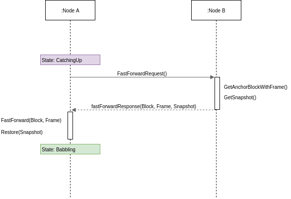
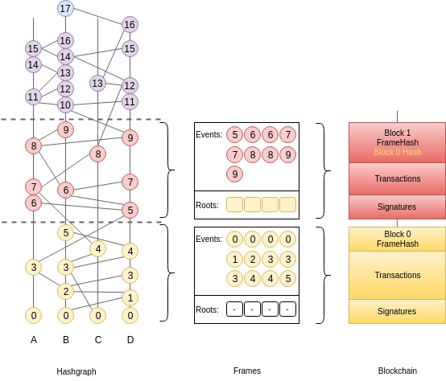
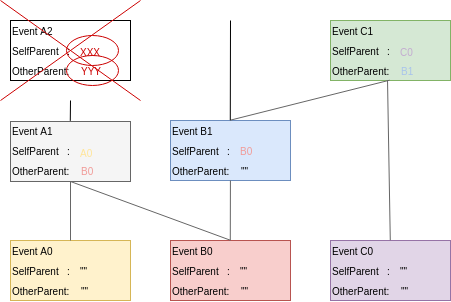

.. _fastsync:

FastSync
========

FastSync is an element of the Babble protocol which enables nodes to catch up
with other nodes without downloading and processing the entire history of
gossip (Hashgraph + Blockchain). It is important in the context of mobile ad
hoc networks where users dynamically create or join groups, and where limited
computing resources call for periodic pruning of the underlying data store. The
solution relies on linking snapshots of the application state to independent
and self-contained sections of the Hashgraph, called Frames. A node that fell
back too far may fast-forward straight to the latest snapshot, initialize a new
Hashgraph from the corresponding Frame, and get up to speed with the other
nodes without downloading and processing all the transactions it missed. Of
course, the protocol maintains the BFT properties of the base algorithm by
packaging relevant data in signed blocks; here again we see the benefits of
using a blockchain mapping on top of Hashgraph. Although implementing the
Snapshot/Restore functionality puts extra strain on the application developer,
it remains entirely optional; FastSync can be activated or deactivated via
configuration.

Overview
--------

The Babble node is implemented as a state-machine where the possible states
are: **Babbling**, **CatchingUp**, **Joining**, **Leaving**, and **Shutdown**.
When a node is started and belongs to the current validator-set, it will either
enter the **Babbling** state, or the **CatchingUp** state, depending on whether
the **fast-sync** flag was passed to Babble.

In the **CatchingUp** state, a node determines the best node to fast-sync from
(the node which has the longest hashgraph) and attempts to fast-forward to
their last consensus snapshot, until the operation succeeds. Hence, FastSync
introduces a new type of command in the communication protocol: *FastForward*.

Upon receiving a FastForwardRequest, a node must respond with the last
consensus snapshot, as well as the corresponding Hashgraph section (the Frame)
and Block. With this information, and having verified the Block signatures
against the other items as well as the known validator set, the requesting node
attempts to reset its Hashgraph from the Frame, and restore the application
from the snapshot. The difficulty resides in defining what is meant by *last
consensus* snapshot, and how to package enough information in the Frames as to
form a base for a new/pruned Hashgraph.

Frames
------

Frames are self-contained sections of the Hashgraph. They are composed of
FrameEvents which wrap regular Hashgraph Events along with precomputed values
for Round, Witness, and LamportTimestamp. Usually, these values would be
calculated by every node locally but since FrameEvents belong to Blocks, which
eventually collect enough signatures (>1/3), they can be used directly.
Basically, Frames form a valid foundation for a new Hashgraph, such that
gossip-about-gossip routines are not discontinued, while earlier records of the
gossip history are ignored.

.. code:: go

  type Frame struct {
      Round    int //RoundReceived
      Peers    []*peers.Peer
      Roots    map[string]*Root
      Events   []*FrameEvent         //Events with RoundReceived = Round
      PeerSets map[int][]*peers.Peer //[round] => Peers
  }

A Frame corresponds to a Hashgraph consensus round. Indeed, the consensus
algorithm commits Events in batches, which we map onto Frames, and finally onto
a Blockchain. This is an evolution of the previously defined :ref:`blockchain
mapping <blockchain>`. Block headers now contain a Frame hash. As we will see
later, this is useful for security. The Events in a Frame are the Events of the
corresponding batch, in consensus order.

Roots
-----

Frames also contain Roots, with a certain number of past FrameEvents for each
particpant. Intuitively, "replanting" a Hashgraph requires deep enough roots.
The Hashgraph is an interlinked chain of Events, where each Event contains two
references to anterior Events (SelfParent and OtherParent). Upon inserting an
Event in the Hashgraph, we check that its references point to existing Events
(Events that are already in the Hashgraph) and that at least the SelfParent
reference is not empty. This is partially illustrated in the following picture
where Event A2 cannot be inserted because its references are unknown.

If, when resetting from a Frame, we only used the Events associated with the
corresponding round-received, we would quickly run into a situation where
future Events reference unknown/older Events, and fail to be inserted. Hence,
we need to package a "history" of past Events in the Frame, as a base layer for
resetting the Hashgraph; this is contained in the Roots.

What matters is that every participant computes the same Roots, and that Roots
contain sufficient information to keep inserting Events in a Reset hashgraph
and compute a consensus order.

As of today, the number of FrameEvents in each Root (the root depth) is
hard-coded to 10, to avoid nodes from using different values, which would
result in different Blocks, and forks (partitions).

Note that there is still a possibility for an Event's OtherParent to refer to
an Event "below" the Frame. This is possible due to the asynchronous nature of
the gossip routines, but is an unlikely scenario. The Frame design tries to
find a compromise between the size and the amount of useful information they
contain. A root depth of 10 offers a high-enough probability of success.

FastForward
-----------

Frames may be used to initialize or reset a Hashgraph to a clean state, with
indexes, rounds, blocks, etc., corresponding to a capture of a live run, such
that further Events may be inserted and processed independently of past Events.
Hashgraph Frames are loosely analogous to IFrames in video encoding, which
enable fast-forwarding to any point in the video.

To avoid being tricked into fast-forwarding to an invalid state, the protocol
ties Frames to the corresponding Blockchain by including Frame hashes in
affiliated Block headers. A *FastForwardResponse* includes a Block and a Frame,
such that, upon receiving these objects, the requester may check the Frame hash
against the Block header, and count the Block signatures against the **known**
set of validators, before resetting the Hashgraph from the Frame.

Note the importance for the requester to be aware of the validator set of the
Hashgraph it wishes to sync with; it is fundamental when it comes to verifying
a Block. With a dynamic validator set, however, an additional mechanism will be
necessary to securely track changes to the validator set.

Snapshot/Restore
----------------

It is one thing to catch-up with the Hashgraph and Blockchain, but nodes also
need to catch-up with the application state. we extended the Proxy interface
with methods to retrieve and restore snapshots.

.. code:: go

  type AppProxy interface {
    SubmitCh() chan []byte
    CommitBlock(block hashgraph.Block) (CommitResponse, error)
    GetSnapshot(blockIndex int) ([]byte, error)
    Restore(snapshot []byte) error
  }

Since snapshots are raw byte arrays, it is up to the application layer to
define what the snapshots represent, how they are encoded, and how they may be
used to restore the application to a particular state. The *GetSnapshot* method
takes a *blockIndex* parameter, which implies that the application should keep
track of snapshots for every committed block. As the protocol evolves, we will
likely link this to a *FrameRate* parameter to reduce the overhead on the
application caused by the need to take all these snapshots.

So together with a Frame and the corresponding Block, a FastForward request
comes with a snapshot of the application for the node to restore the
application to the corresponding state. If the snapshot was incorrect, the node
will immediately diverge from the main chain because it will obtain different
state hashes upon committing new blocks.

Improvements and Further Work
-----------------------------

The protocol is not entirely watertight yet; there are edge cases that could
quickly lead to forks and diverging nodes.

1) Although it is unlikely, Events above the Frame that reference parents from
"below" the Frame. These Events will fail to be inserted into the Hashgraph,
and the node would stop making progress.

2) The snapshot is not directly linked to the Blockchain, only indirectly
through resulting StateHashes.

Both these issues could be addressed with a general retry mechanism, whereby
the FastForward method is made atomic by working on a temporary copy of the
Hashgraph. If an error or a fork are detected, try to FastSync again from
another Frame. This requires further work and design on fork detection and
self-healing protocols.
